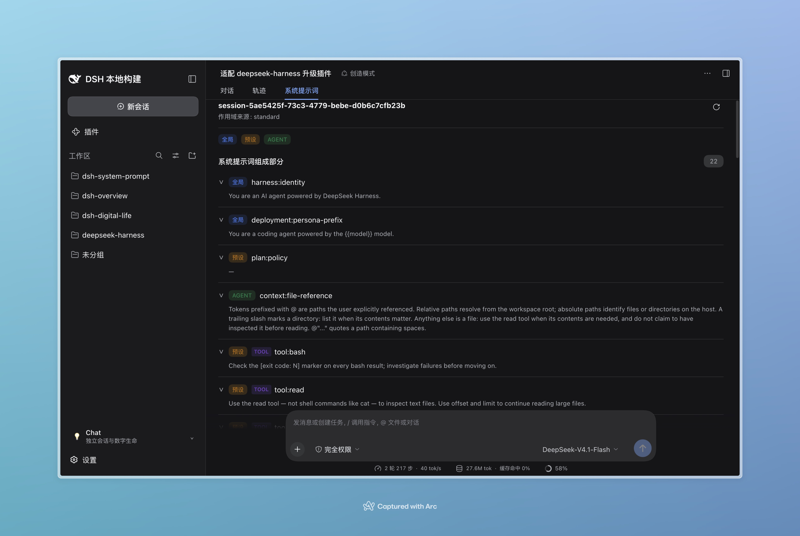
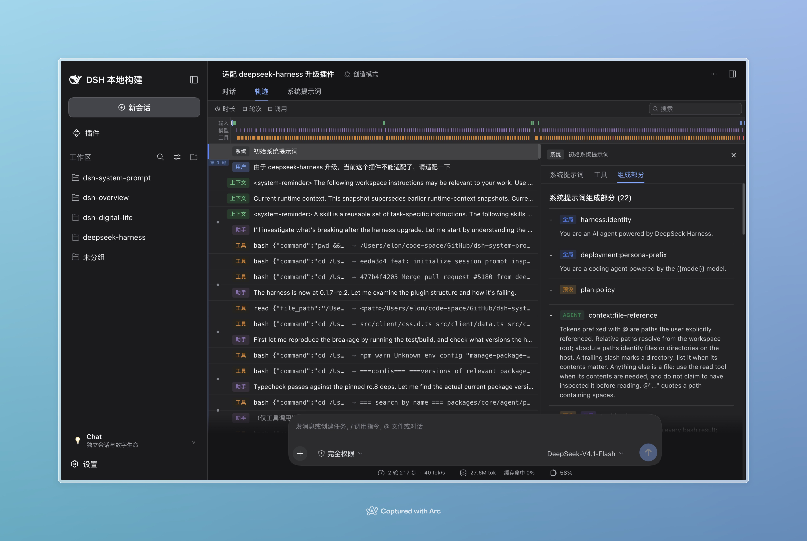

# dsh-system-prompt

`dsh-system-prompt` is a read-only DeepSeek Harness plugin for inspecting the
effective prompt of a live session.

Its only product behavior is session-scoped prompt inspection.

It owns two browser surfaces:

- `conversation.view` (`order: 30`): a session inspection tab showing prompt
  sections, runtime contexts, variables, tools, and producer-supplied messages.
- A `Sections` detail tab beside `ui-trajectory`'s system-prompt tabs. It is a
  bounded DOM bridge because the upstream trajectory package does not expose a
  detail-tab slot.

The host exposes only `session` on `/dsh-system-prompt`. The endpoint accepts
`{ sessionId }`, reads the matching live agent, and returns a small JSON
projection. It never serializes a live `Context`, `Agent`, `Session`, service,
or Cordis object.


## Screenshots

The screenshots show the Chinese `系统提示词` conversation tab and `组成部分`
trajectory detail tab (English: `System Prompt` and `Sections`).

| Conversation inspection | Trajectory system prompt details |
| --- | --- |
|  |  |

## Build

This package follows `dsh-plugin-template`'s self-contained package shape:

```sh
npm run typecheck
npm run build
```

The host and declarations are emitted by `tsdown`. The browser half is then
written as the Harness `window.__ModuleLoader__` closure bundle.

Install the package into a profile with:

```sh
dsh plugin --profile web add github:elonnzhang/dsh-system-prompt
```

The repository commits its `lib/` bundle, so this GitHub install does not need
to execute a package build script or modify the profile `allowBuilds` list.
The bundle also supplies the Web Connection's `webServer` injection required
for plugin RPC channels; no separate profile-local RPC patch is needed.
For local source development, run `npm run build` explicitly before testing.

## Test with deepseek-harness

For source-level browser testing, link this checkout into the Harness `web`
profile, then run the plugin watcher and Harness in separate terminals:

```sh
# in this repository
npm run dev

# in ../deepseek-harness
pnpm dsh plugin --profile web add link:/Users/elon/code-space/GitHub/dsh-system-prompt
pnpm dsh web --no-open --port 3080
```

Open the URL printed by `dsh web` (including its launch `token` on first
visit); a bare <http://127.0.0.1:3080> returns 401 without an existing browser
session. The watcher rebuilds `lib/` after changes under
`src/` or `scripts/`; refresh the Harness page when the browser bundle is
reloaded. Verify both the conversation inspection view and the trajectory
`System Prompt / Tools / Sections` detail flow. For a clean one-off check,
`npm test` validates types, generated bundles, JavaScript syntax, the smoke
contract, and host RPC runtime checks before starting Harness.


## Provenance boundary

There is no `./invariant` export: this plugin owns no independent mutable
relationship outside Cordis effects to check.

Prompt, context, variable, and tool ownership is reported at `global` / `preset`
/ `agent` scope. The underlying registries do not retain the registering Fiber,
so this plugin does not claim a more precise plugin-level owner.
